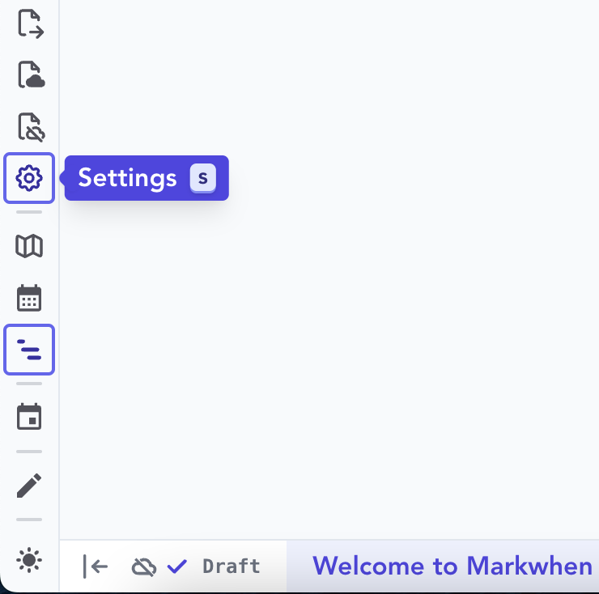
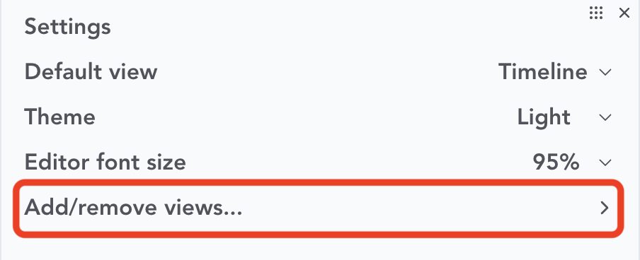
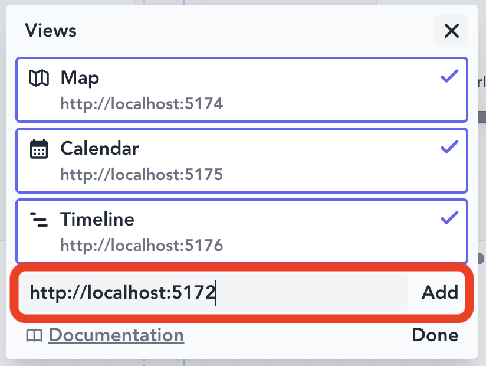
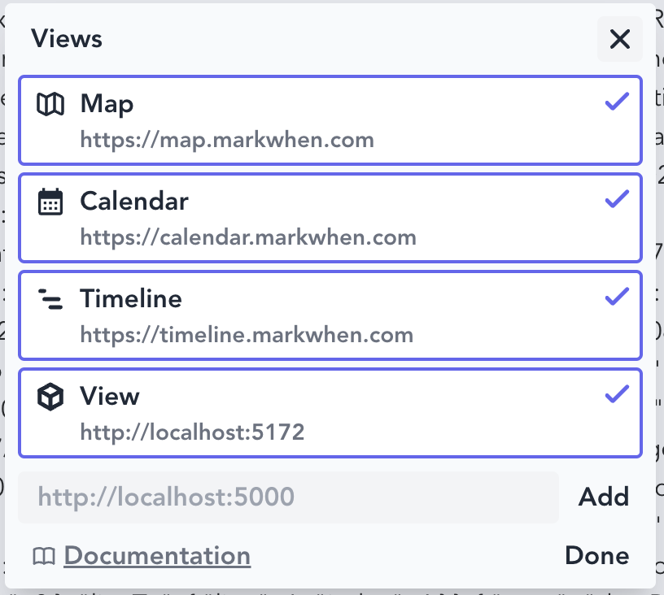
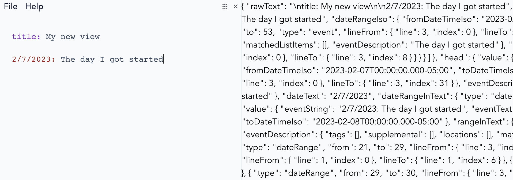

## Markwhen view template (Vue)

Start by cloning this repository, installing necessary dependencies, and running the server:

```
> git clone git@github.com:mark-when/vue-view-template.git
> cd vue-view-template
> npm i
> npm run dev
```

<hr>

Either clone [markwhen](https://github.com/mark-when/markwhen) or go to [markwhen.com](https://markwhen.com) and add your new view:






<hr>

This template view merely spits out the entire parser output:



<hr>

Get started changing things in [App.vue](src/App.vue).